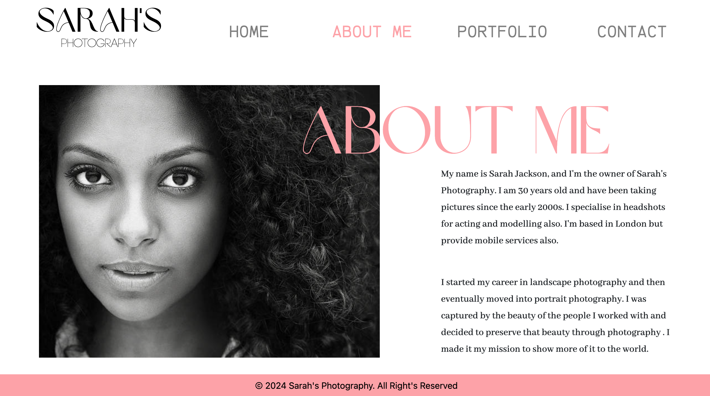
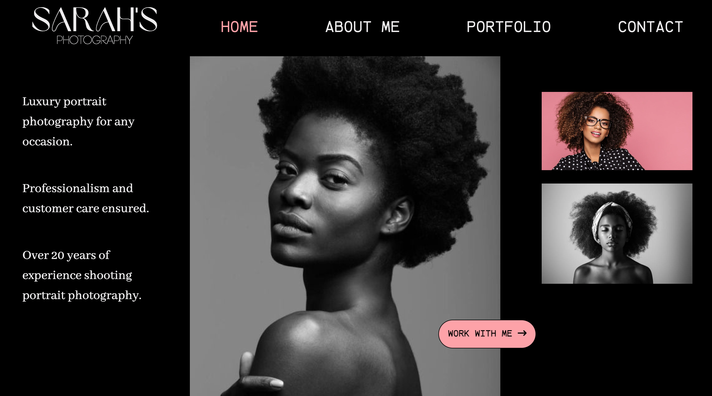
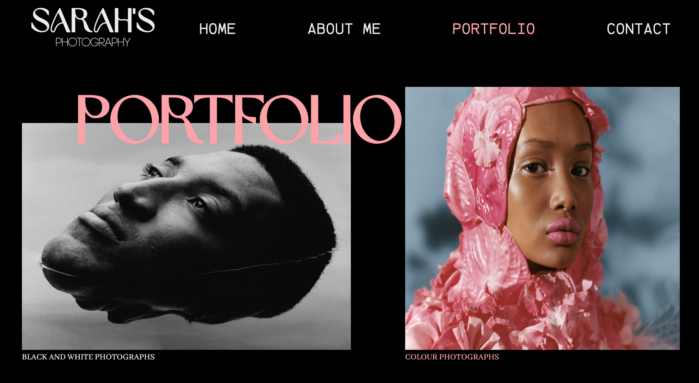
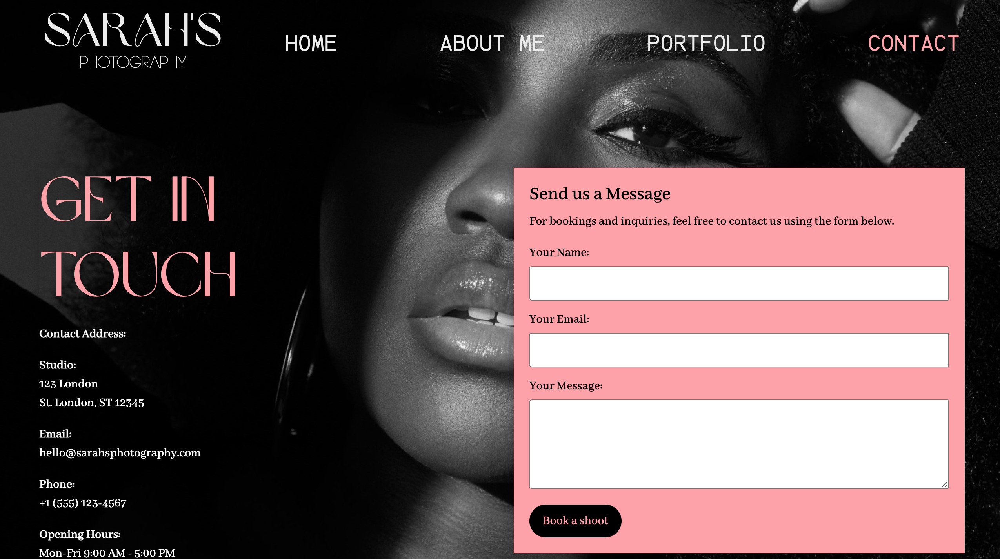

# Sarah The Photographer

This is a group portfolio project of a fictional photographer called Sarah. She specialises in headshots
for acting and modelling. She is based in London but provides mobile services also. She currently needs a portfolio website were she can showcase her work in order to reach more clients.

## The Brief

Sarah is a professional photographer who specializes in portrait photography.

#### Portfolio Requirements

-  A homepage with a brief introduction and a featured image gallery.
-  A portfolio page showcasing her best portrait photographs.
-  An about page with her bio, photography style, and contact information.
-  Contact page with a contact form.

#### Expectations

Sarah wants a clean and elegant website that highlights her photography
skills. She values simplicity and easy navigation. She hopes the website will attract potential
clients who are looking for portrait photography services.

## Our Solution

As a group, our main objectives center around creating a dynamic, engaging and responsive website for Sarah the photographer. our object was to showcase the diverse and captivating portfolio of Sarah's photography work, ensuring that it reflects the artistry and professionalism of the brand. Our collective effort is directed towards providing comprehensive information about Sarah's Photography, including services offered, studio details, and contact information.

We put together the following in place in order to meet Sarah's expectations

#### Canva Design

A portfolio design was created using Canva to serve as our design file. This provided us with a vision of what the final outcome of the website would look like. It also guided us with ensuring that our design systems, which includes color codes, fonts and buttons were uniform.

#### Github Repository

A github repository was created to ensure collaboration as a team. Each member created their respective branches in order to avoid conflicts when pushing to the repository.

#### Technologies Used

Frontend: HTML, CSS
Other Tools: Git, VSCode, Bootstrap

## Sarah's Portfolio

[Sarah's Portfolio](sarahs-portfolio-project.vercel.app)

#### Home Page

#### About Page

#### Portfolio Page

#### Contact Page

## Team Members

-  [Mutiat Bashua](https://github.com/MutiatBash) - Home Page Implementation
-  [Bolaji](https://github.com/toomanyfishb) - Portfolio Page Implementation
-  [Beatrice Ajah](https://github.com/Onyiajah) - Contact Page Implementation
-  [Priscilla](https://github.com/Pazil24) - About Page Implementation

## Conclusion

This project enhanced our understanding of a responsive web design, frontend
technologies like Bootstrap, and the importance of user-centric design for a seamless user
experience. Additionally, handling tasks such as code optimization, and addressing compatibility issues broadened our knowledge in building a user-friendly web page.
Overall, the group project provided a holistic view of the web development process, from planning and design to implementation and testing, significantly enriching our skill set.
